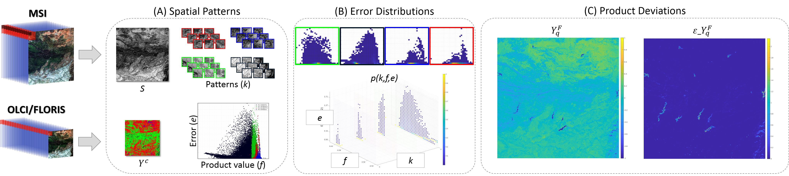

# Sentinel-3/FLEX Biophysical Product Confidence Using Sentinel-2 Land-Cover Spatial Distributions

[Ruben Fernandez-Beltran](https://scholar.google.es/citations?user=pdzJmcQAAAAJ&hl=es), [Filiberto Pla](https://scholar.google.es/citations?user=mSSPcAMAAAAJ&hl=es), [Jian Kang](https://github.com/jiankang1991), [Jose Moreno](https://www.researchgate.net/profile/Jose-Moreno-39), [Antonio Plaza](https://www.umbc.edu/rssipl/people/aplaza/)
---

This repo contains the codes for the JSTARS paper: [Sentinel-3/FLEX Biophysical Product Confidence Using Sentinel-2 Land-Cover Spatial Distributions](https://ieeexplore.ieee.org/abstract/document/9376247). The estimation of biophysical variables from remote sensing data raises important challenges in terms of the acquisition technology and its limitations. In this way, some vegetation parameters, such as chlorophyll fluorescence, require sensors with a high spectral resolution that constrains the spatial resolution while significantly increasing the subpixel land-cover heterogeneity. Precisely, this spatial variability often makes that rather different canopy structures are aggregated together, which eventually generates important deviations in the corresponding parameter quantification. In the context of the Copernicus program (and other related Earth Explorer missions), this article proposes a new statistical methodology to manage the subpixel spatial heterogeneity problem in Sentinel-3 (S3) and FLuorescence EXplorer (FLEX) by taking advantage of the higher spatial resolution of Sentinel-2 (S2). Specifically, the proposed approach first characterizes the subpixel spatial patterns of S3/FLEX using inter-sensor data from S2. Then, a multivariate analysis is conducted to model the influence of these spatial patterns in the errors of the estimated biophysical variables related to chlorophyll which are used as fluorescence proxies. Finally, these modeled distributions are employed to predict the confidence of S3/FLEX products on demand. Our experiments, conducted using multiple operational S2 and simulated S3 data products, reveal the advantages of the proposed methodology to effectively measure the confidence and expected deviations of different vegetation parameters with respect to standard regression algorithms.





## Usage

`./codes/x.m` is the training script for .

`./codes/y.m` is the training script for .

## Citation

```
@article{fernandez2021sentinel,
  title={{Sentinel-3/FLEX Biophysical Product Confidence using Sentinel-2 Land Cover Spatial Distributions}},
  author={Fernandez-Beltran, Ruben and Pla, Filiberto and Kang, Jian and Moreno, Jose F and Plaza, Antonio J},
  journal={IEEE Journal of Selected Topics in Applied Earth Observations and Remote Sensing},
  volume={14},
  pages={3447-3461},
  year={2021},  
  publisher={IEEE},
  doi={10.1109/JSTARS.2021.3065582}
}
```

## References

[1] J. Verrelst et al., “Machine learning regression algorithms for biophysical parameter retrieval: Opportunities for Sentinel-2 and -3,” Remote Sens. Environ., vol. 118, pp. 127–139, 2012.


